# Guion Completo del Desarrollo del E-commerce GameHub

## 📋 Índice

1. [Inicio Rápido](#inicio-rápido)
2. [Introducción General](#introducción-general)
3. [Arquitectura del Proyecto](#arquitectura-del-proyecto)
4. [Backend - JSON Server](#backend---json-server)
5. [Frontend - React + Vite](#frontend---react--vite)
6. [Flujo de Datos](#flujo-de-datos)
7. [Conclusiones](#conclusiones)

---

## 🚀 Inicio Rápido

### Requisitos Previos

-   **Node.js**: versión 18 o superior (verificar con `node --version`)
-   **npm**: versión 8 o superior (verificar con `npm --version`)

### Estructura Final del Proyecto

```
clase41/
├── backend/
│   ├── node_modules/       # Dependencias del backend
│   ├── db.json            # Base de datos JSON
│   ├── package.json       # Configuración npm
│   └── package-lock.json  # Versiones exactas
│
├── frontend/
│   ├── node_modules/      # Dependencias del frontend
│   ├── public/           # Archivos estáticos
│   │   └── vite.svg      # Icono de Vite
│   ├── src/              # Código fuente
│   │   ├── components/   # Componentes reutilizables
│   │   │   ├── Header.jsx
│   │   │   ├── Cart.jsx
│   │   │   ├── ProductCard.jsx
│   │   │   └── ProductList.jsx
│   │   ├── pages/        # Páginas de la app
│   │   │   ├── Home.jsx
│   │   │   └── Products.jsx
│   │   ├── services/     # Capa de servicios
│   │   │   └── api.js
│   │   ├── store/        # Estado global
│   │   │   └── useCartStore.js
│   │   ├── App.jsx       # Componente principal
│   │   ├── main.jsx      # Punto de entrada
│   │   └── index.css     # Estilos con Tailwind
│   ├── .gitignore
│   ├── index.html        # HTML principal
│   ├── package.json      # Dependencias
│   ├── vite.config.js    # Config de Vite
│   ├── tailwind.config.js # Config de Tailwind
│   └── postcss.config.js  # Config de PostCSS
│
└── EXPLICACION.md        # Esta documentación

```

### Instalación Completa del Proyecto

#### Opción 1: Instalación Manual Paso a Paso

```bash
# 1. BACKEND - Configuración del servidor API
mkdir backend
cd backend
npm init -y
npm install json-server@0.17.4

# 2. FRONTEND - Configuración de la aplicación React
cd ..  # Volver a la raíz del proyecto
npm create vite@latest frontend -- --template react
cd frontend
npm install
npm install react-router-dom@6.17.0 zustand@4.4.1
npm install -D tailwindcss@3.4.18 postcss@8.5.6 autoprefixer@10.4.21 @tailwindcss/line-clamp@0.4.4
npx tailwindcss init -p
```

### Configuración de Tailwind CSS

#### tailwind.config.js

```javascript
// ARCHIVO: tailwind.config.js - Configuración de Tailwind CSS
// Tailwind es un framework CSS utility-first (utilidades primero)
// En lugar de escribir CSS, usamos clases predefinidas

/** @type {import('tailwindcss').Config} */
// El comentario @type ayuda con el autocompletado en VS Code

module.exports = {
    // CONTENT: Le dice a Tailwind dónde buscar las clases que usamos
    // Esto es crucial para el tree-shaking (eliminar CSS no usado)
    content: [
        // Escanea el HTML principal
        "./index.html",

        // Escanea todos los archivos de componentes React
        // ** significa cualquier carpeta (recursivo)
        // * significa cualquier nombre de archivo
        // {js,ts,jsx,tsx} significa cualquiera de estas extensiones
        "./src/**/*.{js,ts,jsx,tsx}",
    ],

    // THEME: Personalización del sistema de diseño de Tailwind
    theme: {
        // extend: agregamos personalizaciones sin sobrescribir las defaults
        extend: {
            // Aquí podríamos agregar:
            // colors: { 'brand-blue': '#1e40af' }  // Colores custom
            // fontFamily: { 'gaming': ['Orbitron', 'sans-serif'] }  // Fuentes custom
            // spacing: { '128': '32rem' }  // Espaciados custom
        },
    },

    // PLUGINS: Extensiones oficiales o de terceros
    plugins: [
        // line-clamp: permite truncar texto a N líneas con ellipsis
        // Muy útil para descripciones de productos
        require("@tailwindcss/line-clamp"),

        // Otros plugins útiles:
        // require('@tailwindcss/forms'),  // Estilos para formularios
        // require('@tailwindcss/typography'),  // Estilos para contenido de texto
    ],
};

// ¿Por qué Tailwind?
// 1. No escribimos CSS custom = menos archivos
// 2. Consistencia automática = todos usan las mismas clases
// 3. Responsive por defecto = sm:, md:, lg:, xl:
// 4. Tree-shaking = solo incluye el CSS que usamos
// 5. Desarrollo rápido = no cambias entre archivos
```

#### index.css

```css
/* ARCHIVO: index.css - Punto de entrada de estilos globales */
/* Este archivo se importa en main.jsx */

/* ============= DIRECTIVAS DE TAILWIND ============= */
/* Estas directivas inyectan el CSS de Tailwind */

/* @tailwind base: Reset CSS y estilos base */
/* Normaliza diferencias entre navegadores */
/* Resetea margins, paddings, etc. */
@tailwind base;

/* @tailwind components: Clases de componentes predefinidos */
/* Por ejemplo: .btn, .card (si las definiéramos) */
@tailwind components;

/* @tailwind utilities: Todas las clases de utilidad */
/* Esto es el corazón de Tailwind: .text-blue-500, .p-4, etc. */
@tailwind utilities;

/* ============= PERSONALIZACIONES ============= */
/* @layer base: modificaciones a los estilos base */
/* Se aplican globalmente a todos los elementos */
@layer base {
    /* Optimizaciones para el renderizado de texto */
    html {
        /* font-synthesis: none */
        /* Evita que el navegador sintetice negrita/cursiva si no existe */
        font-synthesis: none;

        /* text-rendering: optimizeLegibility */
        /* Mejora la legibilidad activando ligaduras y kerning */
        /* Puede afectar performance en textos muy largos */
        text-rendering: optimizeLegibility;

        /* -webkit-font-smoothing: antialiased */
        /* Mejora el renderizado de fuentes en Safari/Chrome en Mac */
        /* Hace que las fuentes se vean más delgadas y nítidas */
        -webkit-font-smoothing: antialiased;

        /* -moz-osx-font-smoothing: grayscale */
        /* Similar para Firefox en Mac */
        -moz-osx-font-smoothing: grayscale;
    }

    /* Fuente del sistema para mejor performance y consistencia */
    body {
        /* Stack de fuentes del sistema operativo */
        /* Usa la fuente nativa de cada OS para mejor integración */
        font-family: -apple-system, /* macOS/iOS nueva */ BlinkMacSystemFont, /* macOS/iOS antigua */
                "Segoe UI", /* Windows */ "Roboto", /* Android */ "Oxygen",
            /* KDE */ "Ubuntu", /* Ubuntu */ "Cantarell",
            /* GNOME */ "Fira Sans", /* Firefox OS */ "Droid Sans",
            /* Android antiguo */ "Helvetica Neue", /* macOS fallback */
                sans-serif; /* Fallback genérico */
    }
}

/* Si necesitáramos estilos custom adicionales: */
/* @layer components {
  .btn-primary {
    @apply bg-blue-600 text-white px-4 py-2 rounded;
  }
} */
```

**¿Por qué Tailwind CSS?**

-   **Utility-first**: Construcción rápida sin escribir CSS
-   **Responsive**: Clases responsivas integradas
-   **Consistencia**: Sistema de diseño unificado
-   **Performance**: Solo incluye CSS usado (tree-shaking)

### Ejecutar el Proyecto

**Terminal 1 - Backend:**

```bash
cd backend
npm run dev
# Servidor API disponible en http://localhost:3001
```

**Terminal 2 - Frontend:**

```bash
cd frontend
npm run dev
# Aplicación disponible en http://localhost:5173
```

### Verificación

1. Abre http://localhost:3001/products en tu navegador - deberías ver el JSON de productos
2. Abre http://localhost:5173 en tu navegador - deberías ver la aplicación GameHub funcionando
3. Si ves errores de conexión, verifica que ambos servidores estén ejecutándose

---

## 🎯 Introducción General

### ¿Qué es este proyecto?

GameHub es un **e-commerce completo de productos gaming** desarrollado con arquitectura cliente-servidor. El proyecto está diseñado para demostrar conceptos modernos de desarrollo web, incluyendo:

-   **Separación de responsabilidades**: Backend y Frontend independientes
-   **Estado global**: Manejo centralizado del carrito de compras
-   **API REST**: Comunicación mediante estándares HTTP
-   **Diseño responsivo**: Interfaz adaptable a diferentes dispositivos
-   **Persistencia de datos**: Almacenamiento local y en servidor

### ¿Por qué esta arquitectura?

La separación entre backend y frontend permite:

1. **Desarrollo independiente**: Equipos pueden trabajar en paralelo
2. **Escalabilidad**: Cada parte puede escalar por separado
3. **Mantenibilidad**: Código más organizado y fácil de mantener
4. **Reutilización**: El backend puede servir a múltiples clientes (web, móvil, etc.)

---

## 🏗️ Arquitectura del Proyecto

### Estructura de Carpetas

```
proyecto/
├── backend/               # Servidor API con JSON Server
│   ├── db.json           # Base de datos JSON
│   ├── package.json      # Dependencias del backend
│   └── README.md         # Documentación del backend
│
└── frontend/             # Aplicación React
    ├── src/
    │   ├── components/   # Componentes reutilizables
    │   ├── pages/       # Páginas de la aplicación
    │   ├── services/    # Capa de servicios API
    │   ├── store/       # Estado global con Zustand
    │   ├── App.jsx      # Componente principal
    │   ├── main.jsx     # Punto de entrada
    │   └── index.css    # Estilos globales
    ├── package.json     # Dependencias del frontend
    └── vite.config.js   # Configuración de Vite
```

### Stack Tecnológico

#### Backend

-   **JSON Server**: Simula una API REST completa sin código
-   **Node.js**: Entorno de ejecución JavaScript

#### Frontend

-   **React 19**: Biblioteca UI con componentes
-   **Vite**: Build tool ultrarrápido
-   **Zustand**: Estado global simple y eficiente
-   **React Router**: Navegación SPA
-   **Tailwind CSS**: Framework de utilidades CSS

---

## 💾 Backend - JSON Server

### 1. Configuración Inicial (package.json)

#### Comandos de instalación:

```bash
# Crear el directorio del backend
mkdir backend
cd backend

# Inicializar el proyecto Node.js
npm init -y

# Instalar JSON Server
npm install json-server@0.17.4
```

#### Archivo package.json resultante:

```json
{
    // Comenzamos creando nuestro package.json para el backend
    // El nombre debe ser descriptivo - usamos kebab-case por convención de npm
    "name": "ecommerce-backend",

    // Versión inicial siguiendo versionado semántico (major.minor.patch)
    // Empezamos con 1.0.0 porque es nuestro primer release estable
    "version": "1.0.0",

    // Descripción clara para que cualquier desarrollador entienda el propósito
    // Mencionamos JSON Server para dejar claro que es un mock server
    "description": "JSON Server backend for ecommerce application",

    // Aunque JSON Server no requiere un archivo principal,
    // es buena práctica especificarlo para futuras expansiones
    "main": "server.js",

    // Scripts son los comandos que ejecutaremos frecuentemente
    "scripts": {
        // Comando 'start' - estándar en Node.js para iniciar la aplicación
        // --watch: observa cambios en db.json y reinicia automáticamente
        // --port 3001: usamos 3001 porque React típicamente usa 3000
        "start": "json-server --watch db.json --port 3001",

        // 'dev' es un alias común para desarrollo
        // Duplicamos el comando para que sea más intuitivo (npm run dev)
        "dev": "json-server --watch db.json --port 3001"
    },

    // Dependencias de producción - solo necesitamos JSON Server
    "dependencies": {
        // json-server es nuestra única dependencia
        // Versión ^0.17.4 significa: acepta actualizaciones menores y patches
        // El ^ permite 0.17.5, 0.18.0, pero NO 1.0.0 (breaking changes)
        "json-server": "^0.17.4"
    }
}
```

**¿Por qué JSON Server?**

-   **Rapidez de desarrollo**: API completa en minutos
-   **Sin configuración**: CRUD automático para cada recurso
-   **Perfecto para prototipos**: Ideal para MVP y demos
-   **Persistencia local**: Los datos se guardan en db.json

#### Comando para iniciar el backend:

```bash
# Desde la carpeta backend/
npm run dev
# o
npm start

# El servidor estará disponible en http://localhost:3001
# Verás en la consola:
# \{^_^}/ hi!
# Loading db.json
# Done
```

### 2. Base de Datos (db.json)

```javascript
{
  // JSON Server espera un objeto con las colecciones (recursos) de nuestra API
  // Cada propiedad del objeto se convierte en un endpoint REST automáticamente

  // Primera colección: productos
  // El nombre 'products' generará automáticamente los endpoints /products
  "products": [
    // Cada producto es un objeto con propiedades consistentes
    {
      // ID numérico - JSON Server lo auto-incrementa si creamos nuevos
      // IMPORTANTE: Debe ser numérico para que JSON Server maneje las rutas
      "id": 1,

      // Nombre del producto - usamos español porque es un e-commerce latino
      // String simple, sin formateo especial
      "nombre": "PlayStation 5 Slim",

      // Descripción detallada para mostrar en las cards
      // Incluimos características principales para atraer al comprador
      "descripcion": "Consola Sony PlayStation 5 Slim con SSD 1TB, ray tracing, 4K gaming",

      // PRECIO EN CENTAVOS - Muy importante esta decisión:
      // 899999 = $8,999.99 pesos
      // ¿Por qué centavos? Evitamos problemas de punto flotante en JavaScript
      // 0.1 + 0.2 = 0.30000000000000004 en JS, mejor trabajar con enteros
      "precio": 899999,

      // URL externa para las imágenes - no las guardamos localmente
      // Usamos Unsplash porque:
      // 1. No necesitamos gestionar archivos
      // 2. Las imágenes son optimizadas y rápidas
      // 3. Podemos especificar el tamaño con parámetros (?w=300)
      "imagen": "https://images.unsplash.com/photo-1606144042614-b2417e99c4e3?w=300"
    },
    // Más productos siguen el mismo patrón...
  ],

  // Segunda colección: órdenes de compra
  // El nombre 'orders' generará automáticamente los endpoints /orders
  "orders": [
    {
      // ID autogenerado por JSON Server cuando hacemos POST
      "id": 1,

      // Array de productos en esta orden
      // Guardamos una copia de los datos del producto en el momento de la compra
      // ¿Por qué? Los precios pueden cambiar, pero la orden debe mantener el histórico
      "productos": [
        {
          // Copiamos el ID para referencia (opcional)
          "id": 3,
          // Guardamos el nombre para mostrar en el historial
          "nombre": "Razer BlackWidow V4 Pro",
          // Precio AL MOMENTO DE LA COMPRA - puede diferir del precio actual
          "precio": 349999,
          // Cuántas unidades compró de este producto
          "cantidad": 1
        }
        // Puede haber múltiples productos en una orden
      ],

      // Total de la orden - lo calculamos en el frontend y lo guardamos
      // ¿Por qué guardarlo? Para evitar recalcular y mantener consistencia histórica
      "total": 3949995,

      // Timestamp en formato ISO 8601 - estándar internacional
      // new Date().toISOString() en JavaScript genera este formato
      // Incluye fecha, hora y zona horaria (Z = UTC)
      "fecha": "2025-10-16T00:39:59.965Z"
    }
    // Más órdenes se agregarán automáticamente con POST
  ]
}
```

**Decisiones de diseño:**

-   **Precios en centavos**: Evita problemas de punto flotante
-   **IDs numéricos**: JSON Server los maneja automáticamente
-   **Estructura plana**: Facilita las queries y actualizaciones
-   **URLs externas para imágenes**: Reduce el tamaño del proyecto

### 3. Endpoints Automáticos

JSON Server genera automáticamente estos endpoints:

```bash
# Productos
GET    /products          # Listar todos
GET    /products/:id      # Obtener uno
POST   /products          # Crear nuevo
PUT    /products/:id      # Actualizar completo
PATCH  /products/:id      # Actualizar parcial
DELETE /products/:id      # Eliminar

# Órdenes
GET    /orders            # Listar todas
GET    /orders/:id        # Obtener una
POST   /orders            # Crear nueva orden
PUT    /orders/:id        # Actualizar orden
DELETE /orders/:id        # Eliminar orden
```

---

## ⚛️ Frontend - React + Vite

### Instalación y Configuración del Frontend

#### Comandos de instalación:

```bash
# Crear el proyecto con Vite (desde la carpeta raíz del proyecto)
npm create vite@latest frontend -- --template react
cd frontend

# Instalar las dependencias base
npm install

# Instalar dependencias de producción
npm install react-router-dom@6.17.0 zustand@4.4.1

# Instalar Tailwind CSS y sus dependencias
npm install -D tailwindcss@3.4.18 postcss@8.5.6 autoprefixer@10.4.21
npm install -D @tailwindcss/line-clamp@0.4.4

# Inicializar Tailwind CSS
npx tailwindcss init -p
```

#### Versiones instaladas:

**Dependencias de producción:**

-   **react**: ^19.1.1 - Librería principal de UI
-   **react-dom**: ^19.1.1 - Renderizado de React para el DOM
-   **react-router-dom**: ^6.17.0 - Navegación SPA
-   **zustand**: ^4.4.1 - Manejo de estado global

**Dependencias de desarrollo:**

-   **vite**: ^7.1.7 - Build tool y servidor de desarrollo
-   **@vitejs/plugin-react**: ^5.0.4 - Plugin de React para Vite
-   **tailwindcss**: ^3.4.18 - Framework CSS utility-first
-   **postcss**: ^8.5.6 - Procesador de CSS
-   **autoprefixer**: ^10.4.21 - Añade prefijos vendor automáticamente
-   **@tailwindcss/line-clamp**: ^0.4.4 - Plugin para truncar texto

### 1. Punto de Entrada (main.jsx)

```javascript
// ARCHIVO: main.jsx - El punto de entrada de nuestra aplicación React
// Este es el primer archivo que se ejecuta cuando carga la aplicación

// Importamos StrictMode de React - es una herramienta de desarrollo
// NO afecta la producción, solo agrega verificaciones en desarrollo
import { StrictMode } from "react";

// createRoot es la nueva API de React 18+ para renderizar
// Reemplaza a ReactDOM.render() que era la forma antigua
import { createRoot } from "react-dom/client";

// Importamos nuestros estilos globales que incluyen Tailwind
// El orden importa: los estilos se cargan antes que los componentes
import "./index.css";

// Importamos nuestro componente principal
// .jsx es opcional, Vite lo resuelve automáticamente
import App from "./App.jsx";

// Buscamos el elemento con id='root' en index.html
// Este es el contenedor donde React montará toda la aplicación
const rootElement = document.getElementById("root");

// Creamos la raíz de React con el nuevo API
const root = createRoot(rootElement);

// Renderizamos la aplicación
root.render(
    // StrictMode es como un "modo debug" que nos ayuda a:
    // 1. Detectar componentes con efectos secundarios
    // 2. Advertir sobre APIs deprecadas
    // 3. Detectar ciclos de vida inseguros
    // 4. Ejecuta efectos dos veces en desarrollo para detectar bugs
    <StrictMode>
        {/* App es nuestro componente principal que contiene toda la aplicación */}
        {/* De aquí se desprenderán todos los demás componentes */}
        <App />
    </StrictMode>
);

// Nota: No hay export porque este archivo no se importa en ningún lado
// Es el punto de entrada definido en index.html con type="module"
```

**¿Por qué StrictMode?**

-   Detecta componentes con efectos secundarios
-   Advierte sobre APIs deprecadas
-   Ayuda a preparar la app para futuras versiones de React

### 2. Componente Principal (App.jsx)

```javascript
// ARCHIVO: App.jsx - Componente raíz que estructura toda la aplicación

// Importamos React (opcional en React 17+, pero buena práctica para claridad)
import React from "react";

// Importamos los componentes de React Router para manejar la navegación
// BrowserRouter: Usa el History API del navegador para URLs limpias
// Routes: Contenedor para las rutas (antes era Switch)
// Route: Define cada ruta individual
import { BrowserRouter as Router, Routes, Route } from "react-router-dom";

// Importamos nuestros componentes principales
import Header from "./components/Header"; // Barra de navegación superior
import Cart from "./components/Cart"; // Drawer del carrito (siempre presente)
import Home from "./pages/Home"; // Página de inicio
import Products from "./pages/Products"; // Página del catálogo

// Definimos el componente App como función (Function Component)
// Es la forma moderna y recomendada vs class components
function App() {
    // El componente retorna JSX - la sintaxis que parece HTML pero es JavaScript
    return (
        // Router envuelve toda la app para habilitar navegación SPA
        // SPA = Single Page Application - no recarga la página al navegar
        <Router>
            {/* Contenedor principal con clases de Tailwind */}
            {/* min-h-screen: altura mínima de toda la pantalla */}
            {/* bg-gray-50: fondo gris claro para contraste */}
            {/* flex flex-col: layout vertical flexible */}
            <div className="min-h-screen bg-gray-50 flex flex-col">
                {/* Header se renderiza siempre, en todas las páginas */}
                {/* No está dentro de Routes porque es persistente */}
                <Header />

                {/* Contenedor principal para el contenido dinámico */}
                {/* flex-1: toma todo el espacio disponible (empuja el footer abajo) */}
                {/* max-w-6xl: ancho máximo para pantallas grandes */}
                {/* mx-auto: centra horizontalmente */}
                {/* w-full: ancho completo en móviles */}
                {/* px-4 py-4: padding horizontal y vertical */}
                <main className="flex-1 max-w-6xl mx-auto w-full px-4 py-4">
                    {/* Routes es el contenedor de todas las rutas */}
                    {/* Solo renderiza la primera Route que coincida con la URL */}
                    <Routes>
                        {/* Ruta para la página de inicio */}
                        {/* path="/" es la raíz del sitio */}
                        {/* element prop recibe el componente a renderizar */}
                        <Route path="/" element={<Home />} />

                        {/* Ruta para el catálogo de productos */}
                        {/* Cuando la URL sea /products, renderiza el componente Products */}
                        <Route path="/products" element={<Products />} />

                        {/* Ruta catch-all para 404 */}
                        {/* El * captura cualquier ruta que no coincida con las anteriores */}
                        {/* Siempre debe ir al final porque las rutas se evalúan en orden */}
                        <Route
                            path="*"
                            element={
                                // Componente inline para el 404 - podría ser un componente separado
                                <div className="text-center py-8 space-y-3">
                                    <h2 className="text-xl font-bold text-gray-900">
                                        Página no encontrada
                                    </h2>
                                    <p className="text-gray-600">
                                        La página que buscas no existe.
                                    </p>
                                    {/* Usamos <a> en lugar de <Link> para forzar recarga y volver al inicio */}
                                    <a
                                        href="/"
                                        className="inline-block bg-blue-600 hover:bg-blue-700 text-white text-sm font-medium py-2 px-4 rounded transition-colors"
                                    >
                                        Volver al inicio
                                    </a>
                                </div>
                            }
                        />
                    </Routes>
                </main>

                {/* Componente Cart está fuera de Routes porque siempre existe */}
                {/* Se muestra/oculta con estado interno, no con rutas */}
                {/* Es un drawer overlay que se superpone al contenido */}
                <Cart />

                {/* Footer fijo en todas las páginas */}
                {/* mt-auto: se empuja al fondo gracias a flex del contenedor padre */}
                <footer className="bg-gray-900 text-white py-4 mt-auto">
                    <div className="max-w-6xl mx-auto px-4 text-center">
                        {/* &copy; es el símbolo de copyright en HTML */}
                        <p className="text-sm">
                            &copy; 2024 GameHub. Todos los derechos reservados.
                        </p>
                        <p className="text-xs text-gray-400">Gaming Store</p>
                    </div>
                </footer>
            </div>
        </Router>
    );
}

// Exportamos el componente para poder importarlo en main.jsx
export default App;
```

**Arquitectura de componentes:**

-   **Layout persistente**: Header y footer siempre visibles
-   **Rutas dinámicas**: El contenido central cambia según la URL
-   **Cart como overlay**: Se superpone cuando está abierto

### 3. Estado Global con Zustand (useCartStore.js)

```javascript
// ARCHIVO: useCartStore.js - Manejo global del estado del carrito
// Zustand es una alternativa ligera a Redux con menos boilerplate

// Importamos create de zustand - función para crear stores
import { create } from "zustand";

// persist es un middleware que guarda automáticamente en localStorage
// Así el carrito persiste aunque el usuario cierre el navegador
import { persist } from "zustand/middleware";

// Creamos y exportamos nuestro store
// La convención es nombrar los hooks custom con 'use' al inicio
export const useCartStore = create(
    // Envolvemos con persist para habilitar persistencia
    persist(
        // Esta función recibe set y get como parámetros
        // set: función para actualizar el estado
        // get: función para leer el estado actual
        (set, get) => ({
            // ============= ESTADO INICIAL =============
            // El estado es un objeto plano con las propiedades que necesitamos

            // Array que contiene los productos del carrito
            // Cada item tiene la estructura: { producto: {...}, cantidad: number }
            items: [],

            // Boolean para controlar si el drawer del carrito está abierto
            // Lo iniciamos cerrado por defecto
            isOpen: false,

            // ============= ACCIONES (MÉTODOS) =============
            // Las acciones son funciones que modifican el estado

            // ACCIÓN: Agregar un producto al carrito
            addItem: (product) => {
                // Primero obtenemos el estado actual de items
                // get() retorna todo el estado, accedemos a items
                const currentItems = get().items;

                // Buscamos si el producto ya existe en el carrito
                // findIndex retorna el índice si lo encuentra, o -1 si no existe
                const existingItemIndex = currentItems.findIndex(
                    // Comparamos por ID que es único para cada producto
                    (item) => item.producto.id === product.id
                );

                // Verificamos si encontramos el producto (índice >= 0)
                if (existingItemIndex >= 0) {
                    // CASO 1: El producto YA EXISTE en el carrito
                    // Debemos incrementar su cantidad

                    // Creamos una copia del array para mantener inmutabilidad
                    // [...array] crea un nuevo array con los mismos elementos
                    // Esto es importante para que React detecte el cambio
                    const updatedItems = [...currentItems];

                    // Incrementamos la cantidad del producto existente
                    updatedItems[existingItemIndex].cantidad += 1;

                    // Actualizamos el estado con set()
                    // Solo pasamos las propiedades que queremos cambiar
                    set({ items: updatedItems });
                } else {
                    // CASO 2: El producto NO EXISTE en el carrito
                    // Lo agregamos como nuevo item con cantidad 1

                    // Usamos set para actualizar items
                    set({
                        // Spread operator para mantener items existentes
                        // y agregar el nuevo al final del array
                        items: [
                            ...currentItems,
                            {
                                producto: product, // El objeto producto completo
                                cantidad: 1, // Empezamos con cantidad 1
                            },
                        ],
                    });
                }
            },

            // ACCIÓN: Decrementar cantidad o eliminar producto del carrito
            removeItem: (productId) => {
                // Obtenemos el estado actual
                const currentItems = get().items;

                // Buscamos el producto por su ID
                const existingItemIndex = currentItems.findIndex(
                    (item) => item.producto.id === productId
                );

                // Solo procedemos si el producto existe en el carrito
                if (existingItemIndex >= 0) {
                    // Creamos copia para inmutabilidad
                    const updatedItems = [...currentItems];

                    // Verificamos la cantidad actual del producto
                    if (updatedItems[existingItemIndex].cantidad > 1) {
                        // Si hay más de 1, solo decrementamos la cantidad
                        updatedItems[existingItemIndex].cantidad -= 1;
                    } else {
                        // Si solo hay 1, eliminamos el producto completamente
                        // splice(index, 1) elimina 1 elemento en la posición index
                        updatedItems.splice(existingItemIndex, 1);
                    }

                    // Actualizamos el estado con el array modificado
                    set({ items: updatedItems });
                }
            },

            // ACCIÓN: Eliminar un producto completamente sin importar la cantidad
            deleteItem: (productId) => {
                // Usamos filter para crear un nuevo array sin el producto
                // filter() retorna un nuevo array con los elementos que cumplan la condición
                set({
                    items: get().items.filter(
                        // Mantenemos todos los items EXCEPTO el que tiene el ID especificado
                        (item) => item.producto.id !== productId
                    ),
                });
            },

            // ACCIÓN: Vaciar completamente el carrito
            clearCart: () => {
                // Simplemente establecemos items como array vacío
                set({ items: [] });
            },

            // GETTER: Calcular el precio total del carrito
            // No modifica el estado, solo calcula y retorna un valor
            getTotal: () => {
                // Usamos reduce para sumar todos los subtotales
                // reduce() acumula un valor recorriendo el array
                return get().items.reduce(
                    // Callback de reduce: (acumulador, elementoActual)
                    (total, item) => {
                        // Calculamos precio * cantidad para cada item y lo sumamos al total
                        // Recordar: precio está en centavos
                        return total + item.producto.precio * item.cantidad;
                    },
                    0 // Valor inicial del acumulador (total empieza en 0)
                );
            },

            // GETTER: Contar la cantidad total de productos en el carrito
            getTotalItems: () => {
                // Similar a getTotal pero sumamos las cantidades
                return get().items.reduce(
                    (total, item) => total + item.cantidad,
                    0
                );
            },

            // ACCIÓN: Abrir el drawer del carrito
            openCart: () => set({ isOpen: true }),

            // ACCIÓN: Cerrar el drawer del carrito
            closeCart: () => set({ isOpen: false }),

            // ACCIÓN: Alternar estado del drawer (abrir/cerrar)
            toggleCart: () => {
                // set también puede recibir una función que recibe el estado anterior
                // Útil cuando necesitamos el valor actual para calcular el nuevo
                set((state) => ({ isOpen: !state.isOpen }));
            },

            // GETTER: Preparar datos del carrito para enviar al backend
            getOrderData: () => {
                // Obtenemos los items actuales
                const items = get().items;
                // Calculamos el total usando nuestra función getTotal
                const total = get().getTotal();

                // Retornamos un objeto con el formato que espera el backend
                return {
                    // Mapeamos los items para incluir solo los datos necesarios
                    productos: items.map((item) => ({
                        id: item.producto.id, // ID del producto
                        nombre: item.producto.nombre, // Nombre para el historial
                        precio: item.producto.precio, // Precio al momento de la compra
                        cantidad: item.cantidad, // Cantidad comprada
                    })),
                    total: total, // Total de la orden
                    fecha: new Date().toISOString(), // Timestamp ISO 8601 (2024-01-01T00:00:00.000Z)
                };
            },
        }),
        // Segundo parámetro del persist: configuración
        {
            // Nombre de la clave en localStorage
            // Se guardará como 'cart-storage' en el navegador
            name: "cart-storage",

            // partialize permite elegir qué partes del estado persistir
            // Solo guardamos items, no isOpen (no queremos que el drawer quede abierto)
            partialize: (state) => ({ items: state.items }),
        }
    )
);
```

**¿Por qué Zustand?**

-   **Simplicidad**: Menos boilerplate que Redux
-   **Performance**: Re-renders optimizados automáticamente
-   **Persistencia**: Integración fácil con localStorage
-   **DevTools**: Compatible con Redux DevTools

### 4. Capa de Servicios API (api.js)

```javascript
// ARCHIVO: api.js - Capa de abstracción para comunicación con el backend
// Centralizamos todas las llamadas a la API en un solo lugar
// Esto facilita el mantenimiento y los cambios futuros

// URL base del servidor backend
// En desarrollo apunta a localhost, en producción cambiaría
// Puerto 3001 porque React usa 3000 por defecto
const API_BASE_URL = "http://localhost:3001";

// Opciones por defecto para todas las peticiones HTTP
// Se aplicarán a todas las peticiones que necesiten enviar datos
const defaultOptions = {
    headers: {
        // Content-Type indica al servidor qué tipo de datos enviamos
        // application/json es el estándar para APIs REST modernas
        "Content-Type": "application/json",
    },
};

// Función helper para procesar todas las respuestas HTTP
// Centraliza el manejo de errores y el parsing de JSON
const handleResponse = async (response) => {
    // response.ok es true si el status es 200-299 (exitoso)
    if (!response.ok) {
        // Si hay error HTTP, lanzamos una excepción con el status
        // Esto nos permite usar try/catch en los componentes
        throw new Error(`HTTP error! status: ${response.status}`);
    }

    // Si la respuesta es exitosa, parseamos el JSON
    // response.json() retorna una promesa con los datos
    return await response.json();
};

// Objeto que agrupa todos los servicios relacionados con productos
// Exportamos como const para que no se pueda reasignar
export const productsAPI = {
    // MÉTODO: Obtener todos los productos del catálogo
    getAll: async () => {
        try {
            // Hacemos la petición GET al endpoint de productos
            // fetch retorna una promesa con la respuesta HTTP
            const response = await fetch(`${API_BASE_URL}/products`);

            // Procesamos la respuesta con nuestra función helper
            // Esto parseará el JSON o lanzará error si algo falla
            return await handleResponse(response);
        } catch (error) {
            // Logueamos el error para debugging
            console.error("Error fetching products:", error);

            // Re-lanzamos el error para que el componente pueda manejarlo
            // Esto permite mostrar mensajes de error al usuario
            throw error;
        }
    },

    // MÉTODO: Obtener un producto específico por su ID
    getById: async (id) => {
        try {
            // Construimos la URL con el ID del producto
            // Ejemplo: http://localhost:3001/products/1
            const response = await fetch(`${API_BASE_URL}/products/${id}`);
            return await handleResponse(response);
        } catch (error) {
            // Incluimos el ID en el mensaje de error para debugging
            console.error(`Error fetching product ${id}:`, error);
            throw error;
        }
    },

    // MÉTODO: Crear un nuevo producto (funcionalidad para admin)
    create: async (product) => {
        try {
            const response = await fetch(`${API_BASE_URL}/products`, {
                // Spread operator para incluir las opciones por defecto
                ...defaultOptions,
                // Método POST para crear recursos nuevos
                method: "POST",
                // Convertimos el objeto JavaScript a JSON string
                // JSON.stringify serializa el objeto para enviarlo por HTTP
                body: JSON.stringify(product),
            });
            return await handleResponse(response);
        } catch (error) {
            console.error("Error creating product:", error);
            throw error;
        }
    },

    // Podríamos agregar más métodos:
    // update: para actualizar productos
    // delete: para eliminar productos
    // search: para buscar con filtros
};

// Objeto que agrupa todos los servicios relacionados con órdenes
export const ordersAPI = {
    // MÉTODO: Crear una nueva orden de compra (usado en checkout)
    create: async (order) => {
        try {
            // POST request al endpoint de orders
            const response = await fetch(`${API_BASE_URL}/orders`, {
                // Incluimos headers para indicar que enviamos JSON
                ...defaultOptions,
                // POST es el método HTTP para crear recursos
                method: "POST",
                // El body debe ser un string, no un objeto
                // JSON.stringify convierte nuestro objeto order a string JSON
                body: JSON.stringify(order),
            });

            // Procesamos la respuesta (parsear JSON o manejar error)
            return await handleResponse(response);
        } catch (error) {
            // Log para debugging y re-lanzamos para que el componente maneje
            console.error("Error creating order:", error);
            throw error;
        }
    },

    // Podríamos agregar:
    // getAll: para obtener historial de órdenes
    // getById: para ver detalles de una orden
    // update: para actualizar estado de orden
    // cancel: para cancelar una orden
};

// Función adicional para verificar si el servidor está disponible
export const checkServerHealth = async () => {
    try {
        // Hacemos una petición ligera para verificar conectividad
        // _limit=1 limita la respuesta a 1 producto (más rápido)
        const response = await fetch(`${API_BASE_URL}/products?_limit=1`);
        return response.ok; // Retorna true si el servidor responde
    } catch (error) {
        // Si falla la petición, el servidor no está disponible
        console.error("Server health check failed:", error);
        return false;
    }
};
```

**Patrón Repository:**

-   **Abstracción**: Separa la lógica de datos del UI
-   **Centralización**: Un solo lugar para todas las llamadas API
-   **Manejo de errores**: Consistente en toda la aplicación
-   **Testeable**: Fácil de mockear para pruebas

### 5. Componente Header (Header.jsx)

```javascript
// ARCHIVO: Header.jsx - Barra de navegación principal de la aplicación
// Se muestra en todas las páginas y contiene el acceso al carrito

import React from "react";
// Link para navegación SPA, useLocation para detectar la página actual
import { Link, useLocation } from "react-router-dom";
// Importamos nuestro store global de Zustand
import { useCartStore } from "../store/useCartStore";

const Header = () => {
    // useLocation es un hook de React Router que nos da información de la URL actual
    // location.pathname nos da la ruta (ej: '/', '/products')
    const location = useLocation();

    // Extraemos del store solo lo que necesitamos (optimización)
    // getTotalItems: función que cuenta productos en el carrito
    // toggleCart: función para abrir/cerrar el drawer
    const { getTotalItems, toggleCart } = useCartStore();

    // Ejecutamos la función para obtener el número actual de items
    // Esto se re-ejecuta automáticamente cuando el store cambia
    const totalItems = getTotalItems();

    return (
        // Header con estilos de Tailwind
        // bg-white: fondo blanco
        // border-b: borde inferior para separación visual
        // sticky top-0: se pega al top cuando hacemos scroll
        // z-50: z-index alto para estar sobre otros elementos
        <header className="bg-white border-b sticky top-0 z-50">
            {/* Contenedor del contenido con ancho máximo y centrado */}
            {/* max-w-7xl: ancho máximo para pantallas grandes */}
            {/* mx-auto: margin auto en X para centrar */}
            {/* px-4 py-3: padding horizontal y vertical */}
            {/* flex justify-between: flexbox con elementos en extremos */}
            {/* items-center: alinea verticalmente al centro */}
            <div className="max-w-7xl mx-auto px-4 py-3 flex justify-between items-center">
                {/* SECCIÓN 1: Logo/Marca de la tienda */}
                <div className="flex flex-col">
                    {/* Link de React Router - navegación sin recargar página */}
                    <Link
                        to="/" // Navega a la página de inicio
                        className="text-decoration-none hover:opacity-80 transition-opacity"
                    >
                        {/* Nombre de la tienda */}
                        <h1 className="text-xl font-bold text-gray-900">
                            GameHub
                        </h1>
                        {/* Subtítulo - hidden md:block lo oculta en móviles */}
                        <p className="text-xs text-gray-500 hidden md:block">
                            Gaming Store
                        </p>
                    </Link>
                </div>

                {/* SECCIÓN 2: Navegación principal */}
                {/* hidden md:flex: oculto en móviles, visible en tablets+ */}
                <nav className="hidden md:flex">
                    <ul className="flex space-x-6">
                        {/* Link de Inicio */}
                        <li>
                            <Link
                                to="/"
                                // Template string para clases dinámicas
                                // Usamos operador ternario para cambiar estilos según la ruta
                                className={`
                  px-3 py-1.5 rounded-md text-sm font-medium transition-colors
                  ${
                      // Si estamos en la página de inicio
                      location.pathname === "/"
                          ? "bg-blue-600 text-white" // Estilo activo
                          : "text-gray-600 hover:text-blue-600" // Estilo inactivo
                  }
                `}
                            >
                                Inicio
                            </Link>
                        </li>

                        {/* Link de Productos */}
                        <li>
                            <Link
                                to="/products"
                                className={`
                  px-3 py-1.5 rounded-md text-sm font-medium transition-colors
                  ${
                      // Si estamos en la página de productos
                      location.pathname === "/products"
                          ? "bg-blue-600 text-white" // Estilo activo
                          : "text-gray-600 hover:text-blue-600" // Estilo inactivo
                  }
                `}
                            >
                                Productos
                            </Link>
                        </li>
                    </ul>
                </nav>

                {/* SECCIÓN 3: Botón del carrito */}
                <div className="flex items-center">
                    <button
                        // Ejecuta toggleCart del store al hacer click
                        onClick={toggleCart}
                        // aria-label para accesibilidad (lectores de pantalla)
                        aria-label={`Abrir carrito (${totalItems} items)`}
                        // relative: para posicionar el badge absoluto dentro
                        className="relative flex items-center space-x-1.5 bg-blue-600 hover:bg-blue-700 text-white px-3 py-1.5 rounded-md text-sm font-medium transition-colors"
                    >
                        {/* Icono del carrito (emoji por simplicidad) */}
                        <span className="text-base">🛒</span>

                        {/* Badge con contador - renderizado condicional */}
                        {/* Solo se muestra si hay items en el carrito */}
                        {totalItems > 0 && (
                            // Badge posicionado absolutamente sobre el botón
                            // -top-1 -right-1: se sale un poco del botón para visibilidad
                            <span className="absolute -top-1 -right-1 bg-red-500 text-white text-xs font-bold rounded-full w-4 h-4 flex items-center justify-center">
                                {totalItems}
                            </span>
                        )}

                        {/* Texto del botón - oculto en móviles */}
                        <span className="hidden sm:block">
                            Carrito
                            {/* Muestra contador en texto también si hay items */}
                            {totalItems > 0 && ` (${totalItems})`}
                        </span>
                    </button>
                </div>
            </div>
        </header>
    );
};
```

**Características del Header:**

-   **Sticky positioning**: Siempre visible al hacer scroll
-   **Responsive**: Menú adaptable a móviles
-   **Estado activo**: Resalta la página actual
-   **Badge dinámico**: Muestra cantidad de items en tiempo real

### 6. Componente ProductCard (ProductCard.jsx)

```javascript
// ARCHIVO: ProductCard.jsx - Tarjeta individual de producto
// Componente reutilizable que muestra la información de un producto

import React from "react";
import { useCartStore } from "../store/useCartStore";

// Recibe un producto como prop desde el componente padre (ProductList)
const ProductCard = ({ product }) => {
    // Selector específico de Zustand - solo extrae addItem
    // Esto es más eficiente que extraer todo el store
    // El componente solo re-renderiza si addItem cambia (nunca cambia)
    const addItem = useCartStore((state) => state.addItem);

    // Handler para el botón "Agregar al Carrito"
    const handleAddToCart = () => {
        // Llamamos a la función del store pasando el producto completo
        addItem(product);

        // Aquí podríamos agregar feedback visual:
        // - Toast notification
        // - Animación del botón
        // - Sonido de confirmación
    };

    // Función helper para formatear precios
    // Intl.NumberFormat es una API nativa de JavaScript para formateo
    const formatPrice = (price) => {
        return new Intl.NumberFormat(
            "es-AR", // Locale: español de Argentina
            {
                style: "currency", // Formato de moneda
                currency: "ARS", // Peso argentino
                minimumFractionDigits: 0, // Sin decimales si es entero
                maximumFractionDigits: 2, // Máximo 2 decimales
            }
        ).format(price / 100); // Dividimos por 100 porque el precio está en centavos
    };

    return (
        // Contenedor principal de la tarjeta
        // bg-white: fondo blanco
        // rounded-lg: bordes redondeados grandes
        // border: borde gris claro
        // hover:shadow-lg: sombra grande al pasar el mouse
        // transition-all: anima todos los cambios
        // hover:-translate-y-1: se eleva 1 unidad al hover
        // overflow-hidden: oculta contenido que se desborde
        <div className="bg-white rounded-lg border border-gray-200 hover:shadow-lg transition-all duration-300 hover:-translate-y-1 overflow-hidden">
            {/* SECCIÓN 1: Imagen del producto */}
            {/* relative: para posicionar elementos hijos absolutamente si necesario */}
            {/* h-40: altura fija de 160px (40 * 4px) */}
            {/* overflow-hidden: si la imagen es más grande, se corta */}
            <div className="relative h-40 overflow-hidden">
                 {
                        // Si la imagen falla, mostramos un placeholder
                        // e.target es el elemento img que falló
                        e.target.src =
                            "https://via.placeholder.com/300x200?text=No+Image";

                        // También podríamos:
                        // - Ocultar el error: e.target.style.display = 'none'
                        // - Mostrar una imagen local de fallback
                        // - Registrar el error en analytics
                    }}
                />
            </div>

            {/* SECCIÓN 2: Información del producto */}
            {/* p-4: padding de 16px en todos lados */}
            {/* space-y-2: espacio vertical de 8px entre elementos hijos */}
            <div className="p-4 space-y-2">
                {/* Nombre del producto */}
                {/* text-sm: tamaño pequeño de texto */}
                {/* font-semibold: peso de fuente semi-negrita */}
                {/* line-clamp-2: limita a 2 líneas con ellipsis (...) si es más largo */}
                {/* leading-tight: interlineado ajustado */}
                <h3 className="text-sm font-semibold text-gray-900 line-clamp-2 leading-tight">
                    {product.nombre}
                </h3>

                {/* Descripción del producto */}
                {/* text-xs: tamaño extra pequeño */}
                {/* text-gray-500: color gris medio */}
                {/* line-clamp-2: máximo 2 líneas */}
                <p className="text-xs text-gray-500 line-clamp-2">
                    {product.descripcion}
                </p>

                {/* Precio del producto */}
                {/* text-lg: tamaño grande para destacar */}
                {/* font-bold: negrita para énfasis */}
                {/* text-blue-600: color azul corporativo */}
                <div className="text-lg font-bold text-blue-600">
                    {formatPrice(product.precio)}
                </div>
            </div>

            {/* SECCIÓN 3: Botón de acción */}
            {/* p-4 pt-0: padding en todos lados excepto arriba */}
            <div className="p-4 pt-0">
                <button
                    onClick={handleAddToCart} // Ejecuta el handler al click
                    // aria-label para accesibilidad
                    aria-label={`Agregar ${product.nombre} al carrito`}
                    // w-full: ancho completo del contenedor
                    // bg-blue-600: fondo azul
                    // hover:bg-blue-700: azul más oscuro al hover
                    // text-white: texto blanco
                    // py-2.5 px-4: padding vertical y horizontal
                    // rounded-lg: bordes redondeados
                    // transition-colors: anima cambios de color
                    // transform: habilita transformaciones
                    // hover:scale-105: crece 5% al hover
                    // active:scale-95: se encoge 5% al click
                    className="w-full bg-blue-600 hover:bg-blue-700 text-white text-sm font-medium py-2.5 px-4 rounded-lg transition-colors transform hover:scale-105 active:scale-95"
                >
                    Agregar al Carrito
                </button>
            </div>
        </div>
    );
};
```

**Optimizaciones:**

-   **Lazy loading**: Carga imágenes solo cuando son visibles
-   **Fallback de imagen**: Muestra placeholder si falla
-   **Line clamping**: Previene desbordamiento de texto
-   **Micro-interacciones**: Feedback visual en hover y click

### 7. Componente ProductList (ProductList.jsx)

```javascript
// ARCHIVO: ProductList.jsx - Componente que muestra la lista de productos
// Maneja la carga de datos desde la API y renderiza las tarjetas

import React, { useState, useEffect } from "react";
import { productsAPI } from "../services/api";
import ProductCard from "./ProductCard";

const ProductList = () => {
    // ============= ESTADOS LOCALES =============
    // Usamos useState para manejar el estado del componente

    // Estado 1: Array de productos cargados desde el backend
    // Inicializado como array vacío para evitar errores con .map()
    const [products, setProducts] = useState([]);

    // Estado 2: Indicador de carga (true mientras esperamos la respuesta)
    // Iniciamos en true porque cargaremos datos inmediatamente
    const [loading, setLoading] = useState(true);

    // Estado 3: Mensaje de error si algo falla
    // null significa que no hay error
    const [error, setError] = useState(null);

    // ============= EFECTO DE CARGA INICIAL =============
    // useEffect ejecuta código cuando el componente se monta o actualiza
    useEffect(() => {
        // Función asíncrona para cargar productos
        // La definimos dentro del useEffect porque useEffect no puede ser async
        const loadProducts = async () => {
            try {
                // Aseguramos que loading esté en true
                setLoading(true);
                // Limpiamos cualquier error previo
                setError(null);

                // Llamada a la API - puede tardar varios segundos
                // await pausa la ejecución hasta que la promesa se resuelve
                const data = await productsAPI.getAll();

                // Si llegamos aquí, la petición fue exitosa
                // Guardamos los productos en el estado
                setProducts(data);
            } catch (err) {
                // Si algo falla, capturamos el error
                console.error("Error loading products:", err);

                // Guardamos un mensaje user-friendly en el estado
                // No mostramos err.message directamente por seguridad
                setError(
                    "Error al cargar los productos. Verifica que el servidor esté ejecutándose."
                );
            } finally {
                // finally se ejecuta siempre, haya error o no
                // Quitamos el indicador de carga
                setLoading(false);
            }
        };

        // Ejecutamos la función de carga
        loadProducts();
    }, []); // Array de dependencias vacío = solo ejecuta al montar
    // Si pusiéramos [algo], se ejecutaría cada vez que 'algo' cambie

    // Función para reintentar la carga cuando hay error
    const handleRetry = () => {
        // Reiniciamos estados
        setError(null);
        setLoading(true);

        // Volvemos a intentar cargar después de medio segundo
        // El setTimeout evita que el botón parezca que no hace nada
        setTimeout(async () => {
            try {
                const data = await productsAPI.getAll();
                setProducts(data);
            } catch (err) {
                setError(
                    "Error al cargar los productos. Verifica que el servidor esté ejecutándose."
                );
            } finally {
                setLoading(false);
            }
        }, 500);
    };

    // ============= RENDERIZADO CONDICIONAL =============
    // Mostramos diferentes UIs según el estado

    // CASO 1: Estamos cargando datos
    if (loading) {
        return (
            // Contenedor centrado con padding
            <div className="flex flex-col items-center justify-center py-8 space-y-3">
                {/* Spinner animado con Tailwind */}
                {/* animate-spin: rotación continua */}
                {/* border-b-2: solo borde inferior para crear el efecto */}
                <div className="animate-spin rounded-full h-8 w-8 border-b-2 border-blue-600"></div>
                <p className="text-gray-600 text-sm">Cargando productos...</p>
            </div>
        );
    }

    // CASO 2: Hubo un error
    if (error) {
        return (
            // Contenedor de error con estilo de alerta
            <div className="max-w-md mx-auto bg-red-50 border border-red-200 rounded-lg p-4 text-center space-y-3">
                <h3 className="text-base font-semibold text-red-800">
                    ¡Ups! Algo salió mal
                </h3>
                <p className="text-sm text-red-600">{error}</p>

                {/* Botón para reintentar */}
                <button
                    onClick={handleRetry}
                    className="bg-blue-600 hover:bg-blue-700 text-white font-medium py-2 px-4 rounded-lg transition-colors"
                >
                    Reintentar
                </button>

                {/* Ayuda adicional para el desarrollador */}
                <div className="text-sm text-gray-600 bg-gray-100 p-3 rounded">
                    💡 Asegúrate de que el servidor JSON esté ejecutándose en el
                    puerto 3001:
                    <br />
                    <code className="bg-gray-800 text-green-400 px-2 py-1 rounded text-xs">
                        cd backend && npm run dev
                    </code>
                </div>
            </div>
        );
    }

    // CASO 3: No hay productos (pero no hay error)
    if (products.length === 0) {
        return (
            <div className="text-center py-8 space-y-3">
                <h3 className="text-lg font-semibold text-gray-800">
                    No hay productos disponibles
                </h3>
                <p className="text-sm text-gray-600">
                    Parece que no hay productos en la tienda en este momento.
                </p>
                <button
                    onClick={handleRetry}
                    className="bg-blue-600 hover:bg-blue-700 text-white font-medium py-2 px-4 rounded-lg transition-colors"
                >
                    Actualizar
                </button>
            </div>
        );
    }

    // CASO 4: Todo bien, mostramos los productos
    return (
        <div>
            {/* Grid responsivo usando CSS Grid de Tailwind */}
            {/* grid: activa CSS Grid */}
            {/* grid-cols-2: 2 columnas por defecto (móviles) */}
            {/* sm:grid-cols-3: 3 columnas en pantallas pequeñas (640px+) */}
            {/* md:grid-cols-4: 4 columnas en pantallas medianas (768px+) */}
            {/* lg:grid-cols-5: 5 columnas en pantallas grandes (1024px+) */}
            {/* gap-4: espacio de 16px entre elementos */}
            <div className="grid grid-cols-2 sm:grid-cols-3 md:grid-cols-4 lg:grid-cols-5 gap-4">
                {/* Iteramos sobre el array de productos */}
                {products.map((product) => (
                    // Renderizamos un ProductCard por cada producto
                    <ProductCard
                        // key es OBLIGATORIO en listas de React
                        // Debe ser único y estable (no usar index)
                        // React usa key para optimizar el re-renderizado
                        key={product.id}
                        // Pasamos el objeto producto completo como prop
                        product={product}
                    />
                ))}
            </div>
        </div>
    );
};

export default ProductList;
```

**Manejo de estados:**

-   **Loading**: Muestra spinner mientras carga
-   **Error**: Muestra mensaje y opción de reintentar
-   **Empty**: Maneja caso sin productos
-   **Success**: Renderiza la grilla de productos

### 8. Componente Cart (Cart.jsx)

```javascript
// ARCHIVO: Cart.jsx - Drawer del carrito de compras con checkout completo
// Este es el componente más complejo porque maneja todo el flujo de compra

import React, { useState } from "react";
import { useCartStore } from "../store/useCartStore";
import { ordersAPI } from "../services/api";

const Cart = () => {
    // ============= EXTRACCIÓN DEL STORE GLOBAL =============
    // Extraemos todas las propiedades y métodos que necesitamos del store
    const {
        items, // Array de productos en el carrito [{producto, cantidad}]
        isOpen, // Boolean que determina si el drawer está visible
        addItem, // Función para agregar/incrementar un producto
        removeItem, // Función para decrementar cantidad
        deleteItem, // Función para eliminar producto completamente
        clearCart, // Función para vaciar todo el carrito
        getTotal, // Función que calcula el precio total
        getTotalItems, // Función que cuenta el total de items
        closeCart, // Función para cerrar el drawer
        getOrderData, // Función que formatea los datos para el backend
    } = useCartStore();

    // ============= ESTADOS LOCALES DEL COMPONENTE =============
    // Estos estados solo se usan en este componente para el proceso de checkout

    // Estado 1: Indica si estamos procesando el checkout (para mostrar loading)
    const [isCheckingOut, setIsCheckingOut] = useState(false);

    // Estado 2: Indica si el checkout fue exitoso (para mostrar confirmación)
    const [checkoutSuccess, setCheckoutSuccess] = useState(false);

    // Estado 3: Guarda mensajes de error del checkout
    const [checkoutError, setCheckoutError] = useState(null);

    // ============= FUNCIONES HELPER =============

    // Función para formatear precios (igual que en ProductCard)
    const formatPrice = (price) => {
        return new Intl.NumberFormat("es-AR", {
            style: "currency",
            currency: "ARS",
        }).format(price / 100); // Dividir por 100 porque está en centavos
    };

    // Función para cerrar el carrito y limpiar estados
    const handleCloseCart = () => {
        closeCart(); // Cierra el drawer
        setCheckoutError(null); // Limpia errores
        setCheckoutSuccess(false); // Limpia mensaje de éxito
    };

    // ============= FUNCIÓN PRINCIPAL DE CHECKOUT =============
    // Esta función maneja todo el proceso de compra
    const handleCheckout = async () => {
        // PASO 1: Validación - verificar que hay productos
        if (items.length === 0) {
            alert("Tu carrito está vacío"); // TODO: Reemplazar con toast
            return; // Salir sin hacer nada
        }

        // PASO 2: Activar estado de loading
        setIsCheckingOut(true); // Muestra spinner en el botón
        setCheckoutError(null); // Limpia errores previos

        try {
            // PASO 3: Preparar los datos de la orden
            // getOrderData() formatea los items para el backend
            const orderData = getOrderData();

            // PASO 4: Enviar la orden al servidor
            // Esta es una operación asíncrona que puede tardar
            console.log("Enviando orden:", orderData);
            const response = await ordersAPI.create(orderData);

            // PASO 5: Si llegamos aquí, la orden fue creada exitosamente
            console.log("Orden creada exitosamente:", response);

            // Mostrar mensaje de éxito
            setCheckoutSuccess(true);

            // PASO 6: Limpiar el carrito (la compra fue exitosa)
            clearCart();

            // PASO 7: Auto-cerrar después de 3 segundos
            // setTimeout programa una función para ejecutarse después
            setTimeout(() => {
                setCheckoutSuccess(false); // Ocultar mensaje de éxito
                closeCart(); // Cerrar el drawer
            }, 3000); // 3000ms = 3 segundos
        } catch (error) {
            // Si algo falla, capturamos el error
            console.error("Error en checkout:", error);

            // Mostrar mensaje de error al usuario
            // No mostramos error.message por seguridad
            setCheckoutError(
                "Error al procesar la compra. Por favor intenta de nuevo."
            );
        } finally {
            // finally siempre se ejecuta, haya error o no
            // Quitamos el loading del botón
            setIsCheckingOut(false);
        }
    };

    // ============= RENDERIZADO CONDICIONAL =============

    // Si el carrito está cerrado, no renderizar nada
    // Esto mejora la performance porque no renderizamos HTML innecesario
    if (!isOpen) return null;

    // ============= RENDERIZADO PRINCIPAL =============
    return (
        // OVERLAY: Cubre toda la pantalla con fondo oscuro semi-transparente
        // fixed: posición fija respecto al viewport
        // inset-0: top:0, right:0, bottom:0, left:0 (cubre todo)
        // bg-black bg-opacity-50: fondo negro al 50% de opacidad
        // z-50: z-index alto para estar sobre otros elementos
        // flex justify-end: alinea el drawer a la derecha
        <div className="fixed inset-0 bg-black bg-opacity-50 z-50 flex justify-end">
            {/* DRAWER: Panel lateral que contiene el carrito */}
            {/* bg-white: fondo blanco sólido */}
            {/* w-full max-w-md: ancho completo en móvil, máximo 448px en desktop */}
            {/* h-full: altura completa de la pantalla */}
            {/* overflow-y-auto: scroll vertical si el contenido es muy largo */}
            {/* flex flex-col: layout vertical flexible */}
            <div className="bg-white w-full max-w-md h-full overflow-y-auto flex flex-col">
                {/* HEADER DEL CARRITO */}
                <div className="flex justify-between items-center p-4 border-b border-gray-200">
                    <h2 className="text-lg font-semibold">
                        Carrito
                        {/* Muestra cantidad de items entre paréntesis */}
                        {getTotalItems() > 0 && (
                            <span className="text-sm text-gray-500">
                                ({getTotalItems()})
                            </span>
                        )}
                    </h2>

                    {/* Botón de cerrar (X) */}
                    <button
                        className="text-gray-500 hover:text-gray-700 text-2xl w-8 h-8 flex items-center justify-center"
                        onClick={handleCloseCart}
                        aria-label="Cerrar carrito"
                    >
                        ×
                    </button>
                </div>

                {/* CONTENIDO DEL CARRITO */}
                {/* flex-1: toma todo el espacio disponible */}
                <div className="flex-1 p-4">
                    {/* Renderizado condicional basado en si hay items */}
                    {items.length === 0 ? (
                        // CASO 1: Carrito vacío
                        <div className="text-center py-8">
                            <p className="text-gray-500 mb-4">
                                Tu carrito está vacío
                            </p>
                            <button
                                onClick={closeCart}
                                className="bg-blue-600 hover:bg-blue-700 text-white px-4 py-2 rounded text-sm"
                            >
                                Continuar Comprando
                            </button>
                        </div>
                    ) : (
                        // CASO 2: Carrito con productos
                        <>
                            {/* Lista de productos en el carrito */}
                            <div className="space-y-3 mb-4">
                                {items.map((item) => (
                                    // Tarjeta de cada producto en el carrito
                                    <div
                                        key={item.producto.id}
                                        className="flex items-center gap-3 p-3 border border-gray-200 rounded-lg"
                                    >
                                        {/* Imagen miniatura del producto */}
                                         {
                                                e.target.src =
                                                    "https://via.placeholder.com/80x60?text=No+Image";
                                            }}
                                        />

                                        {/* Información del producto */}
                                        <div className="flex-1">
                                            <h4 className="text-sm font-medium text-gray-900">
                                                {item.producto.nombre}
                                            </h4>
                                            <p className="text-xs text-gray-500">
                                                {formatPrice(
                                                    item.producto.precio
                                                )}
                                            </p>
                                        </div>

                                        {/* Controles de cantidad */}
                                        <div className="flex items-center gap-2">
                                            {/* Botón decrementar */}
                                            <button
                                                onClick={() =>
                                                    removeItem(item.producto.id)
                                                }
                                                className="w-6 h-6 bg-gray-100 rounded-full flex items-center justify-center text-sm hover:bg-gray-200"
                                                aria-label="Decrementar cantidad"
                                            >
                                                -
                                            </button>

                                            {/* Cantidad actual */}
                                            <span className="text-sm font-medium w-6 text-center">
                                                {item.cantidad}
                                            </span>

                                            {/* Botón incrementar */}
                                            <button
                                                onClick={() =>
                                                    addItem(item.producto)
                                                }
                                                className="w-6 h-6 bg-gray-100 rounded-full flex items-center justify-center text-sm hover:bg-gray-200"
                                                aria-label="Incrementar cantidad"
                                            >
                                                +
                                            </button>

                                            {/* Botón eliminar completamente */}
                                            <button
                                                onClick={() =>
                                                    deleteItem(item.producto.id)
                                                }
                                                className="ml-2 text-red-500 hover:text-red-700 text-sm"
                                                aria-label="Eliminar producto"
                                            >
                                                🗑️
                                            </button>
                                        </div>

                                        {/* Subtotal del item */}
                                        <div className="text-sm font-medium text-blue-600">
                                            {formatPrice(
                                                item.producto.precio *
                                                    item.cantidad
                                            )}
                                        </div>
                                    </div>
                                ))}
                            </div>

                            {/* Sección de total y botones de acción */}
                            <div className="border-t border-gray-200 pt-4">
                                {/* Total del carrito */}
                                <div className="flex justify-between items-center mb-4">
                                    <span className="text-base font-medium">
                                        Total:
                                    </span>
                                    <span className="text-lg font-bold text-blue-600">
                                        {formatPrice(getTotal())}
                                    </span>
                                </div>

                                {/* Botones de acción */}
                                <div className="space-y-2">
                                    {/* Botón principal de checkout */}
                                    <button
                                        onClick={handleCheckout}
                                        disabled={isCheckingOut} // Deshabilitado mientras procesa
                                        className="w-full bg-blue-600 hover:bg-blue-700 text-white font-medium py-3 px-4 rounded transition-colors disabled:opacity-50 disabled:cursor-not-allowed"
                                    >
                                        {/* Texto dinámico según estado */}
                                        {isCheckingOut
                                            ? "Procesando..."
                                            : "Finalizar Compra"}
                                    </button>

                                    {/* Botón secundario para vaciar carrito */}
                                    <button
                                        onClick={clearCart}
                                        className="w-full border border-gray-300 text-gray-700 hover:bg-gray-50 font-medium py-2 px-4 rounded transition-colors"
                                    >
                                        Vaciar Carrito
                                    </button>
                                </div>
                            </div>

                            {/* Modal de éxito (se muestra después del checkout exitoso) */}
                            {checkoutSuccess && (
                                <div className="fixed inset-0 flex items-center justify-center z-60">
                                    <div className="bg-white p-6 rounded-lg shadow-xl">
                                        <h3 className="text-lg font-bold text-green-600 mb-2">
                                            ¡Compra Exitosa!
                                        </h3>
                                        <p className="text-gray-600">
                                            Tu pedido ha sido procesado
                                            correctamente.
                                        </p>
                                    </div>
                                </div>
                            )}

                            {/* Mensaje de error (se muestra si falla el checkout) */}
                            {checkoutError && (
                                <div className="mt-4 p-3 bg-red-50 border border-red-200 rounded">
                                    <p className="text-red-600 text-sm">
                                        {checkoutError}
                                    </p>
                                    <button
                                        onClick={() => setCheckoutError(null)}
                                        className="text-red-500 text-xs underline mt-1"
                                    >
                                        Cerrar
                                    </button>
                                </div>
                            )}
                        </>
                    )}
                </div>
            </div>
        </div>
    );
};

export default Cart;
```

**Características del carrito:**

-   **Drawer lateral**: Se desliza desde la derecha
-   **Overlay oscuro**: Indica foco en el carrito
-   **Controles de cantidad**: +/- para cada producto
-   **Checkout completo**: Validación, envío y feedback
-   **Estados de UI**: Loading, éxito y error

### 9. Página Home (Home.jsx)

```javascript
// ARCHIVO: Home.jsx - Página de inicio / landing page del e-commerce
// Es la primera página que ve el usuario al entrar al sitio

import React from "react";
import { Link } from "react-router-dom";

const Home = () => {
    return (
        // Contenedor principal con espacio vertical entre secciones
        // space-y-8: agrega 32px de espacio entre elementos hijos
        <div className="space-y-8">
            {/* ============= HERO SECTION ============= */}
            {/* La sección hero es la más importante - primera impresión del usuario */}
            {/* bg-white: fondo blanco para contrastar con el gris del body */}
            {/* rounded-lg: bordes redondeados grandes (8px) */}
            {/* border: borde gris sutil para definición */}
            {/* overflow-hidden: oculta contenido que se desborde (importante para imágenes) */}
            <section className="bg-white rounded-lg border overflow-hidden">
                {/* Grid container para layout responsivo */}
                {/* grid-cols-1: una columna en móvil (apilado vertical) */}
                {/* lg:grid-cols-2: dos columnas en pantallas grandes (1024px+) */}
                {/* gap-6: espacio de 24px entre columnas */}
                {/* items-center: centra verticalmente el contenido */}
                {/* p-6: padding de 24px en todos los lados */}
                <div className="grid grid-cols-1 lg:grid-cols-2 gap-6 items-center p-6">
                    {/* COLUMNA IZQUIERDA: Contenido textual */}
                    {/* space-y-4: espacio de 16px entre elementos */}
                    <div className="space-y-4">
                        {/* Título principal con tamaño responsivo */}
                        {/* text-2xl: 24px en móvil */}
                        {/* lg:text-3xl: 30px en desktop */}
                        {/* leading-tight: interlineado ajustado para títulos */}
                        <h2 className="text-2xl lg:text-3xl font-bold text-gray-900 leading-tight">
                            Bienvenido a
                            {/* Span para colorear parte del texto */}
                            <span className="text-blue-600">GameHub</span>
                        </h2>

                        {/* Subtítulo descriptivo */}
                        {/* text-base: tamaño base de 16px */}
                        {/* text-gray-600: color gris medio para jerarquía visual */}
                        <p className="text-base text-gray-600">
                            Descubre el mejor hardware gaming con tecnología de
                            vanguardia
                        </p>

                        {/* Párrafo adicional con más detalles */}
                        {/* text-sm: texto más pequeño (14px) */}
                        {/* leading-relaxed: interlineado más espaciado para legibilidad */}
                        <p className="text-sm text-gray-700 leading-relaxed">
                            Desde consolas hasta periféricos pro, tenemos todo
                            lo que necesitas para llevar tu gaming al siguiente
                            nivel.
                        </p>

                        {/* CTA (Call To Action) - Botón principal */}
                        <div>
                            {/* Link de React Router para navegación SPA */}
                            <Link
                                to="/products" // Navega al catálogo
                                // inline-block: permite aplicar padding/margin como block pero en línea
                                className="
                  bg-blue-600 hover:bg-blue-700 
                  text-white text-sm font-medium 
                  py-2 px-4 rounded 
                  transition-colors 
                  inline-block
                "
                            >
                                Ver Productos
                            </Link>
                        </div>
                    </div>

                    {/* COLUMNA DERECHA: Imagen hero */}
                    {/* relative: para posicionar elementos hijos si necesario */}
                    <div className="relative">
                        
                    </div>
                </div>
            </section>

            {/* ============= FEATURES SECTION ============= */}
            {/* Sección de características/beneficios - construye confianza */}
            <section className="bg-white rounded-lg border p-6">
                {/* Título de la sección */}
                {/* text-center: centrado para mejor presentación */}
                {/* mb-4: margin bottom de 16px */}
                <h3 className="text-lg font-bold text-gray-900 text-center mb-4">
                    ¿Por qué elegir GameHub?
                </h3>

                {/* Grid de características */}
                {/* grid-cols-2: 2 columnas en móvil para aprovechar espacio */}
                {/* lg:grid-cols-4: 4 columnas en desktop para mostrar todo */}
                {/* gap-4: espacio de 16px entre elementos */}
                <div className="grid grid-cols-2 lg:grid-cols-4 gap-4">
                    {/* CARACTERÍSTICA 1: Envío */}
                    <div className="text-center p-3">
                        {/* Icono usando emoji - alternativa rápida a librerías de iconos */}
                        <div className="text-2xl mb-2">🚚</div>
                        {/* Título de la característica */}
                        <h4 className="text-sm font-semibold text-gray-900 mb-1">
                            Envío Express
                        </h4>
                        {/* Descripción breve */}
                        <p className="text-xs text-gray-600">
                            Entrega gratuita en pedidos superiores a $800.000
                        </p>
                    </div>

                    {/* CARACTERÍSTICA 2: Seguridad */}
                    <div className="text-center p-3">
                        <div className="text-2xl mb-2">🔒</div>
                        <h4 className="text-sm font-semibold text-gray-900 mb-1">
                            Pago Seguro
                        </h4>
                        <p className="text-xs text-gray-600">
                            Múltiples métodos de pago con máxima seguridad
                        </p>
                    </div>

                    {/* CARACTERÍSTICA 3: Calidad */}
                    <div className="text-center p-3">
                        <div className="text-2xl mb-2">⭐</div>
                        <h4 className="text-sm font-semibold text-gray-900 mb-1">
                            Hardware Original
                        </h4>
                        <p className="text-xs text-gray-600">
                            100% productos gaming originales con garantía
                            oficial
                        </p>
                    </div>

                    {/* CARACTERÍSTICA 4: Soporte */}
                    <div className="text-center p-3">
                        <div className="text-2xl mb-2">🔧</div>
                        <h4 className="text-sm font-semibold text-gray-900 mb-1">
                            Soporte Gamer
                        </h4>
                        <p className="text-xs text-gray-600">
                            Asesoría especializada para optimizar tu setup
                            gaming
                        </p>
                    </div>
                </div>
            </section>

            {/* Aquí podríamos agregar más secciones: */}
            {/* - Productos destacados */}
            {/* - Testimonios de clientes */}
            {/* - Newsletter signup */}
            {/* - Marcas que trabajamos */}
        </div>
    );
};

export default Home;
```

**Estructura de la landing:**

-   **Hero section**: Llamada a la acción principal
-   **Grid responsivo**: Se adapta a diferentes pantallas
-   **Features**: Propuesta de valor de la tienda
-   **Visual hierarchy**: Guía el ojo del usuario

### 10. Página Products (Products.jsx)

```javascript
// ARCHIVO: Products.jsx - Página del catálogo de productos
// Página muy simple que actúa como contenedor para ProductList

import React from "react";
import ProductList from "../components/ProductList";

const Products = () => {
    // Esta página es intencionalmente simple
    // Toda la lógica está en ProductList para mantener separación de responsabilidades

    // En una versión más completa, esta página podría incluir:
    // - Filtros por categoría
    // - Ordenamiento (precio, nombre, popularidad)
    // - Búsqueda
    // - Paginación
    // - Breadcrumbs

    return (
        <div>
            {/* Por ahora, simplemente renderizamos el componente ProductList */}
            {/* ProductList maneja todo: carga de datos, estados, y renderizado */}
            <ProductList />

            {/* En el futuro podríamos agregar: */}
            {/* <FilterSidebar /> */}
            {/* <SearchBar /> */}
            {/* <SortingDropdown /> */}
        </div>
    );
};

export default Products;
```

**Diseño simplificado:**

-   **Composición**: Reutiliza el componente ProductList
-   **Sin filtros**: Versión básica sin categorías
-   **Enfoque**: En la funcionalidad core del e-commerce
-   **Extensible**: Fácil agregar features sin romper lo existente

### 12. Configuración de Vite

#### Comando para iniciar el servidor de desarrollo:

```bash
# Desde la carpeta frontend/
npm run dev

# El servidor estará disponible en:
# ➜  Local:   http://localhost:5173/
# ➜  Network: use --host to expose
# ➜  press h + enter to show help
```

#### Comando para construir para producción:

```bash
# Generar build optimizado
npm run build

# Vista previa del build de producción
npm run preview
```

```javascript
// ARCHIVO: vite.config.js - Configuración del build tool
// Vite es el servidor de desarrollo y bundler creado por Evan You (creador de Vue)
// Es MUCHO más rápido que Create React App (webpack)

// Importamos la función defineConfig para tener autocompletado
import { defineConfig } from "vite";

// Plugin oficial de React para Vite
// Maneja JSX, Fast Refresh (hot reload) y optimizaciones
import react from "@vitejs/plugin-react";

// defineConfig nos da type hints y autocompletado en el IDE
export default defineConfig({
    // PLUGINS: Extensiones que agregan funcionalidad a Vite
    plugins: [
        // Plugin de React que habilita:
        // 1. Fast Refresh: actualiza componentes sin perder estado
        // 2. JSX Transform: convierte JSX a JavaScript
        // 3. Babel: transpila código moderno a compatible
        react(),

        // Otros plugins útiles:
        // svgr() - importar SVGs como componentes
        // legacy() - soporte para navegadores antiguos
    ],

    // Configuraciones adicionales que podríamos agregar:

    // SERVER: Configuración del servidor de desarrollo
    // server: {
    //   port: 3000,  // Puerto del servidor (default: 5173)
    //   open: true,  // Abrir navegador automáticamente
    //   proxy: {     // Proxy para evitar CORS en desarrollo
    //     '/api': 'http://localhost:3001'
    //   }
    // },

    // BUILD: Configuración de la build de producción
    // build: {
    //   outDir: 'dist',  // Carpeta de salida
    //   sourcemap: true, // Generar source maps para debugging
    //   minify: 'terser', // Minificador a usar
    //   // Separar vendor code para mejor caching
    //   rollupOptions: {
    //     output: {
    //       manualChunks: {
    //         vendor: ['react', 'react-dom'],
    //         router: ['react-router-dom']
    //       }
    //     }
    //   }
    // },

    // RESOLVE: Configuración de resolución de módulos
    // resolve: {
    //   alias: {
    //     '@': '/src',  // Permite imports como: import Button from '@/components/Button'
    //     '@components': '/src/components',
    //     '@utils': '/src/utils'
    //   }
    // }
});

// ¿Por qué Vite en lugar de Create React App?
// 1. VELOCIDAD: Vite es 10-100x más rápido en desarrollo
// 2. ESM NATIVO: Usa ES modules del navegador, no bundlea en desarrollo
// 3. HMR INSTANTÁNEO: Los cambios se reflejan en milisegundos
// 4. OPTIMIZACIÓN AUTOMÁTICA: Code splitting, lazy loading, tree shaking
// 5. MENOR CONFIGURACIÓN: Funciona out-of-the-box

// ¿Cómo funciona Vite?
// DESARROLLO:
// 1. Sirve archivos directamente sin bundlear
// 2. El navegador importa módulos ES6 nativamente
// 3. Solo transpila el código cuando se solicita
// 4. HMR mediante WebSockets

// PRODUCCIÓN:
// 1. Usa Rollup para bundlear y optimizar
// 2. Minifica y comprime el código
// 3. Genera chunks optimizados para caching
// 4. Elimina código muerto (tree shaking)
```

**Ventajas de Vite:**

-   **HMR ultrarrápido**: Hot Module Replacement instantáneo
-   **Build optimizado**: Rollup para producción
-   **ESM nativo**: Usa módulos ES6 nativos del navegador
-   **Sin bundling en desarrollo**: Más rápido que webpack
-   **Configuración mínima**: Funciona out-of-the-box

---

## 🔄 Flujo de Datos

### Flujo Completo de una Compra

```mermaid
graph TD
    A[Usuario navega] --> B[Lista de productos]
    B --> C[ProductList carga datos]
    C --> D[API fetch products]
    D --> E[JSON Server responde]
    E --> F[Renderiza ProductCards]
    F --> G[Usuario click Agregar]
    G --> H[Zustand addItem]
    H --> I[Estado global actualizado]
    I --> J[Badge carrito actualizado]
    J --> K[Usuario abre carrito]
    K --> L[Cart drawer visible]
    L --> M[Usuario modifica cantidades]
    M --> N[Zustand update]
    N --> O[Usuario click Checkout]
    O --> P[Validación carrito]
    P --> Q[API POST order]
    Q --> R[JSON Server guarda]
    R --> S[Confirmación éxito]
    S --> T[Limpiar carrito]
    T --> U[Cerrar drawer]
```



### 1. Carga Inicial de Productos

```javascript
// FLUJO COMPLETO: Componente -> API Service -> Backend -> Renderizado
// Este es el flujo que ocurre cuando el usuario entra a la página de productos

// ============= PASO 1: MONTAJE DEL COMPONENTE =============
// Cuando ProductList se renderiza por primera vez
useEffect(() => {
    // Este código se ejecuta DESPUÉS del primer render
    // Es el lugar correcto para efectos secundarios como llamadas API
    loadProducts(); // Iniciamos la carga de productos
}, []); // Array vacío = solo se ejecuta una vez al montar

// ============= PASO 2: FUNCIÓN DE CARGA =============
const loadProducts = async () => {
    try {
        // Activamos el spinner de carga
        setLoading(true);

        // Llamada al servicio API (capa de abstracción)
        // Esta línea puede tardar 1-3 segundos dependiendo de la red
        const data = await productsAPI.getAll();

        // Si llegamos aquí, la petición fue exitosa
        // data contiene el array de productos del backend
        setProducts(data); // Guardamos en el estado local
    } catch (error) {
        // Si algo falla (red, servidor caído, etc.)
        console.error("Error:", error);
        setError("No se pudieron cargar los productos");
    } finally {
        // Siempre quitamos el loading, haya error o no
        setLoading(false);
    }
};

// ============= PASO 3: PETICIÓN HTTP AL BACKEND =============
// Dentro de productsAPI.getAll() ocurre esto:
const response = await fetch("http://localhost:3001/products");
// Genera una petición HTTP:
// GET http://localhost:3001/products
// Headers: { Accept: 'application/json' }

// ============= PASO 4: RESPUESTA DEL BACKEND =============
// JSON Server lee db.json y responde con:
// Status: 200 OK
// Content-Type: application/json
// Body: [
//   { "id": 1, "nombre": "PlayStation 5", "precio": 899999, ... },
//   { "id": 2, "nombre": "ASUS ROG Monitor", "precio": 1199999, ... },
//   // ... más productos
// ]

// ============= PASO 5: RENDERIZADO EN REACT =============
// Cuando setProducts(data) se ejecuta, React:
// 1. Actualiza el estado interno
// 2. Detecta que el estado cambió
// 3. Re-renderiza el componente
// 4. Ahora products.length > 0, entonces renderiza:
products.map((product) => (
    <ProductCard
        key={product.id} // React necesita key para optimizar
        product={product} // Pasamos todo el objeto producto
    />
));
// 5. Cada ProductCard se renderiza con su información
```

### 2. Agregar Producto al Carrito

```javascript
// FLUJO COMPLETO: Usuario -> Componente -> Store Global -> LocalStorage
// Este flujo ocurre cada vez que el usuario agrega un producto al carrito

// ============= PASO 1: INTERACCIÓN DEL USUARIO =============
// En ProductCard.jsx, el usuario hace click en el botón
<button
    onClick={handleAddToCart} // Event handler asociado
    className="bg-blue-600 hover:bg-blue-700 ..."
>
    Agregar al Carrito
</button>;

// ============= PASO 2: HANDLER DEL EVENTO =============
// Se ejecuta esta función en ProductCard
const handleAddToCart = () => {
    // addItem viene del store de Zustand
    // product es el prop que recibió el componente
    addItem(product);

    // Aquí podríamos agregar feedback adicional:
    // showToast('¡Producto agregado!');
    // playSound('success.mp3');
    // animateButton();
};

// ============= PASO 3: ACCIÓN EN EL STORE DE ZUSTAND =============
// Dentro del store (useCartStore.js) se ejecuta:
addItem: (product) => {
    // Obtenemos el estado actual del carrito
    const currentItems = get().items;

    // Buscamos si el producto ya está en el carrito
    const existingItemIndex = currentItems.findIndex(
        (item) => item.producto.id === product.id
    );

    if (existingItemIndex >= 0) {
        // CASO A: El producto YA está en el carrito
        // Solo incrementamos la cantidad
        const updatedItems = [...currentItems]; // Copia inmutable
        updatedItems[existingItemIndex].cantidad += 1;

        // Actualizamos el estado
        set({ items: updatedItems });
    } else {
        // CASO B: Es un producto NUEVO en el carrito
        // Lo agregamos con cantidad 1
        set({
            items: [
                ...currentItems, // Mantenemos los productos existentes
                {
                    producto: product, // El producto completo
                    cantidad: 1, // Empezamos con 1
                },
            ],
        });
    }
};

// ============= PASO 4: PERSISTENCIA AUTOMÁTICA =============
// El middleware persist de Zustand detecta el cambio y:
// 1. Serializa el estado a JSON
const serializedState = JSON.stringify({ items: updatedItems });

// 2. Lo guarda en localStorage del navegador
localStorage.setItem("cart-storage", serializedState);

// Esto significa que si el usuario:
// - Recarga la página
// - Cierra y abre el navegador
// - Vuelve mañana
// ¡El carrito seguirá ahí!

// ============= PASO 5: RE-RENDER AUTOMÁTICO =============
// Zustand notifica a todos los componentes que usan el store

// En Header.jsx:
const totalItems = getTotalItems(); // Se recalcula automáticamente
// El badge del carrito se actualiza instantáneamente

// En Cart.jsx (si está abierto):
const items = useCartStore((state) => state.items); // Nuevo array de items
// La lista de productos se re-renderiza con el nuevo item

// La magia de Zustand:
// NO necesitamos props drilling
// NO necesitamos Context providers
// NO necesitamos dispatch ni reducers
// Solo llamamos a la función y todo se actualiza �憎
```

### 3. Proceso de Checkout

```javascript
// Flujo: Validación -> API -> Backend -> Confirmación

// 1. Usuario click "Finalizar Compra"
const handleCheckout = async () => {
  // 2. Validación del carrito
  if (items.length === 0) return;

  // 3. Preparar datos de la orden
  const orderData = {
    productos: items.map(item => ({
      id: item.producto.id,
      nombre: item.producto.nombre,
      precio: item.producto.precio,
      cantidad: item.cantidad
    })),
    total: getTotal(),
    fecha: new Date().toISOString()
  };

  // 4. Enviar al backend
  const response = await ordersAPI.create(orderData);

  // 5. Backend guarda en db.json
  POST http://localhost:3001/orders
  // JSON Server auto-genera ID y guarda

  // 6. Confirmación y limpieza
  clearCart();  // Vacía el carrito
  closeCart();  // Cierra el drawer
};
```

### 4. Sincronización de Estado

```javascript
// El estado se sincroniza en múltiples niveles:

// Nivel 1: Estado local del componente
const [products, setProducts] = useState([]);

// Nivel 2: Estado global con Zustand
const { items, addItem, removeItem } = useCartStore();

// Nivel 3: Persistencia en localStorage
persist(state, {
    name: "cart-storage",
    partialize: (state) => ({ items: state.items }),
});

// Nivel 4: Persistencia en backend
await ordersAPI.create(orderData);
```

---

## 🎯 Conclusiones

### Logros del Proyecto

1. **Arquitectura Escalable**

    - Separación clara entre frontend y backend
    - Componentes reutilizables y modulares
    - Estado global centralizado y persistente

2. **Experiencia de Usuario**

    - Interfaz responsive y moderna
    - Feedback visual inmediato
    - Carrito persistente entre sesiones
    - Proceso de compra simplificado

3. **Mejores Prácticas Implementadas**

    - **Componentes funcionales**: Uso de hooks modernos
    - **Estado inmutable**: Operaciones sin mutación directa
    - **Async/Await**: Manejo limpio de promesas
    - **Error boundaries**: Manejo de errores robusto
    - **Code splitting**: Carga optimizada con Vite

4. **Tecnologías Modernas**
    - React 19 con las últimas características
    - Zustand para estado simple y eficiente
    - Tailwind CSS para estilos utility-first
    - Vite para desarrollo ultrarrápido

### Posibles Mejoras Futuras

1. **Funcionalidades**

    - Sistema de autenticación de usuarios
    - Búsqueda y filtrado de productos
    - Categorías y subcategorías
    - Sistema de reviews y ratings
    - Wishlist/favoritos
    - Historial de órdenes

2. **Técnicas**

    - Tests unitarios y de integración
    - CI/CD pipeline

3. **Backend**
    - Migrar a base de datos real (PostgreSQL/MongoDB)
    - Autenticación con JWT
    - Validación de datos con schemas
    - Rate limiting y seguridad
    - WebSockets para actualizaciones en tiempo real

### Aprendizajes Clave

1. **Zustand vs Redux**

    - Zustand requiere mucho menos boilerplate
    - Perfecto para aplicaciones medianas
    - Integración sencilla con localStorage

2. **Tailwind CSS**

    - Desarrollo más rápido sin escribir CSS custom
    - Consistencia automática en el diseño
    - Excelente para prototipos rápidos

3. **JSON Server**

    - Ideal para desarrollo y prototipos
    - Simula API REST completa sin backend real
    - Permite enfocarse en el frontend primero

4. **Vite vs Create React App**
    - Inicio instantáneo del servidor
    - HMR más rápido y confiable
    - Mejor experiencia de desarrollo

### Comandos Útiles Adicionales

#### Backend:

```bash
# Ver logs del servidor
cd backend && npm run dev

# Verificar que el servidor esté funcionando
curl http://localhost:3001/products

# Reiniciar la base de datos (cuidado: borra todos los datos)
cp db.json.backup db.json  # Si tienes un backup
```

#### Frontend:

```bash
# Instalar todas las dependencias de nuevo
cd frontend && npm install

# Limpiar caché de node_modules
rm -rf node_modules package-lock.json
npm install

# Build de producción
npm run build

# Servir el build de producción localmente
npm run preview
```

### Solución de Problemas Comunes

**Error: "Cannot GET /products"**

```bash
# Solución: Asegúrate de que el backend esté corriendo
cd backend && npm run dev
```

**Error: "Network Error" o "Failed to fetch"**

```bash
# Solución: Verifica que el backend esté en el puerto 3001
# y que la URL en api.js sea http://localhost:3001
```

**Error: "Module not found"**

```bash
# Solución: Reinstalar dependencias
cd frontend && npm install
```

**Error: "Port 3001/5173 already in use"**

```bash
# Solución: Matar el proceso que usa el puerto
# En Mac/Linux:
lsof -i :3001  # Ver qué usa el puerto
kill -9 [PID]  # Reemplazar [PID] con el número del proceso

# O cambiar el puerto en package.json del backend:
"dev": "json-server --watch db.json --port 3002"
```

### Resumen Final

Este proyecto de e-commerce demuestra la implementación exitosa de un sistema completo de comercio electrónico usando tecnologías modernas. La arquitectura elegida permite:

-   **Desarrollo ágil**: Separación de responsabilidades clara
-   **Mantenibilidad**: Código organizado y documentado
-   **Escalabilidad**: Fácil de extender con nuevas características
-   **Performance**: Optimizado para carga rápida y respuesta inmediata
-   **UX moderna**: Interfaz intuitiva y responsive

El proyecto sirve como base sólida para un e-commerce real, necesitando principalmente mejoras en seguridad, autenticación y migración a una base de datos robusta para estar listo para producción.

---

## 📚 Recursos y Referencias

-   [React Documentation](https://react.dev/)
-   [Zustand GitHub](https://github.com/pmndrs/zustand)
-   [Tailwind CSS Docs](https://tailwindcss.com/)
-   [Vite Guide](https://vitejs.dev/)
-   [JSON Server](https://github.com/typicode/json-server)
-   [React Router](https://reactrouter.com/)
